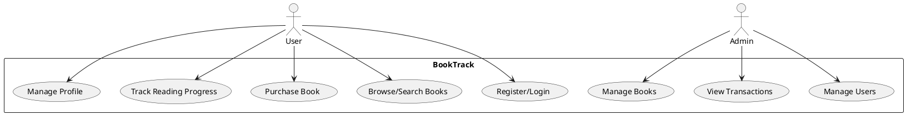
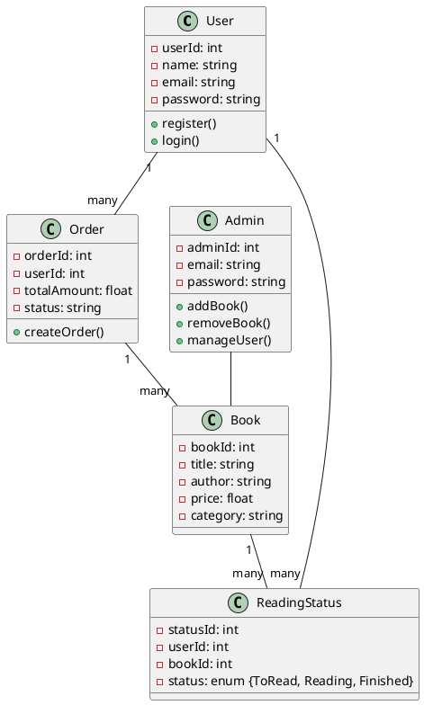
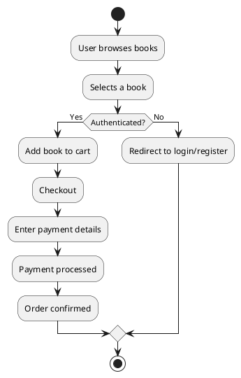
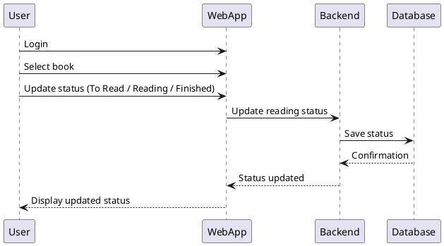

# 1️⃣ Use Case Diagram

Shows interactions between users and the system.

---

# 2️⃣ Class Diagram

Represents main entities and their relationships.

---

# 3️⃣ Activity Diagram (Book Purchase Flow)

---

# 4️⃣ Sequence Diagram (Track Book Status)

---
